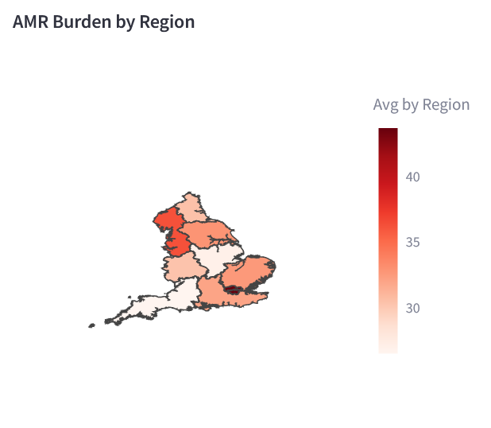
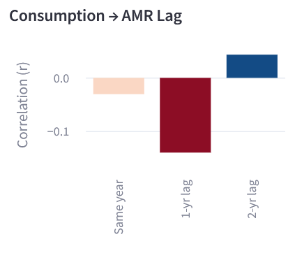
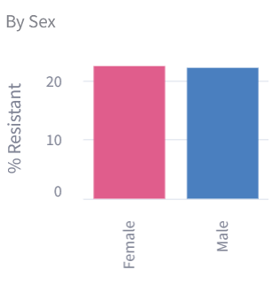
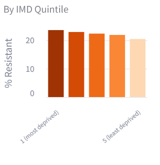
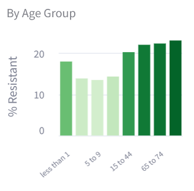
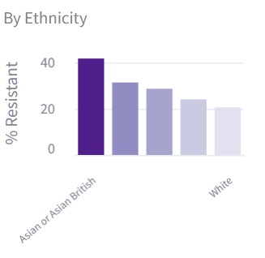

# Antibiotic Resistance Analysis

## Overview

Antibiotics are medications used to treat bacterial infections, and have had an immensely positive effect on our society. However, bacteria can mutate to resist antibiotics and render them ineffective, so it is imperative that we monitor the rates of antibiotic resistant infections closely to ensure the future of one of our most integral treatments.

In this project I used ESPAUR reports to attempt to answer three questions about antibiotic consumption and antibiotic resistance (AMR):
- Where in the UK does AMR occur most frequently?
- Does antibiotic consumption cause a lagged increase in AMR?
- In which demographics is AMR most common?

The streamlit dashboard for this analysis can be seen here: [text](https://antibiotic-resistance-analysis-gptcbzjkqxepkzn6nuahv3.streamlit.app/)

## Data
- English Surveillance Programme for Antimicrobial Utilisation Report (ESPAUR) years 2020-2025
    - Antibiotic Consumption per 100,000 population, years 2020-2025 (years before this do not have consistent data collection)
    - Rates of resistant infections per 100,000 population, years 2020-2025
    - Rates of AMR by Sex, Age, Ethnicity, and Deprivation (IMD Quantile) for years 2024-2025 (only years available)
- All files were in CSV format and cleaned using Python (pandas)
- [ESPAUR Report 2024-2025 (historical data can be accessed from here)](https://www.gov.uk/government/publications/english-surveillance-programme-for-antimicrobial-utilisation-and-resistance-espaur-2024-to-2025-report)

## Methods

- All files were cleaned of trailing spaces, unnecessary quotation marks, and the region names were standardised
- Data of interest was isolated and filtered using SQL. 
- Pandas, plotly, and streamlit were used to create an infographic displaying findings.

- The average (2020-2025) AMR rate by region of the UK is shown using a geogjson heatmap.
- The latency effect of antibiotic consumption is shown through a graph showing the correlation rate of antibiotic consumption and antibiotic resistance over the same year, 1 year later, and 2 years later.
- 4 bar charts are shown, displaying the prevelance of AMR by sex, age group, ethnicity, and deprivation (IMD quantile)

## Results

Section 1: AMR Burden by Region

The region with the highest AMR on average was London. This is not a surprising result as London has an extremely high population density in comparison to the rest of the UK and the population also has high access to hospitals in the city. The regions also with high AMR rates were the North West (Manchester, Lancashire, Merseyside, Cheshire, and Cumbria) and the East of England (Essex, Hertfordshire, Bedfordshire, Cambridgeshire, Norfolk and Suffolk). 
The North West is an interesting case as it has a low population density compared to the rest of the UK, however I would hypothesise that AMR is more common in the cities in the south of this region.

The regions with the least AMR were the South West (Cornwall, Dorset, Devon, Bristol, Gloucestershire, Somerset, and Wiltshire), East Midlands (Derbyshire, Leicestershire, Lincolnshire, Northamptonshire, Nottinghamshire, and Rutland), and West Midlands (Birmingham, Coventry, Dudley, Sandwell, Solihull, Walsall, and Wolverhampton).
Of these the most surprising is the West Midlands, being the most populated region in the UK after London. I could further an investigation by exploring this.

Section 2: Consumption > AMR Lag Effect

At first glance, the graph shows negative correlation between consumption in one year and an AMR increase the year afterwards, suggesting that an increase in prescription actually causes a decrease in AMR rates, which is counterintuitive and contrary to widely accepted research.
When analysing the significance of the data, it is found to be too weak to draw confident conclusions:
- The same-year correlation coefficient is -0.031, which is far too weak to indicate a correlation
- The 1-year-lag correlation coefficient is -0.141, which I would consider a notable but weak correlation, however the p-value is 0.411, far too large for this to be considered a confident finding.
- The 2-year-lag correlation coefficient is positive, indicating that a high prescription rate in one year causes an increase in AMR 2 years later, however this correlation is very weak and the p-value is 0.828, which is still far too high to make reliable conclusions.
Overall, this section of the analysis was not conclusive, largely due to the extremely limited datasets available. With access to more data, I would be able to draw conclusions which would likely fall in line with the accepted notion that higher prescription rates cause higher AMR.

Section 3: Resistance by Demographic Factor

The first graph (Sex) shows that females are very slightly more likely to contract an antibiotic resistant infection, however this is only a difference of 0.3% and therefore is insignificant, concluding that males and females have the same likelihood of contracting AMR.

The second graph (IMD Quantile) shows that as areas are more deprived, they are more likely to contract an antibiotic resistant infection, with a 3.1% difference between areas with the highest deprivation (1) and the lowest (5). 

The third graph (Age group) shows that as one ages, they are more likely to contract an antibiotic resistant infection. This is unsurprising, likely as older people tend to get unwell at higher rates, causing antibiotic prescription and therefore AMR, and also are more likely to spend time in hospitals where antibiotic resistant infections often develop. As well as this, infants under the age of 1 are also more likely to contract AMR, which is likely due to their undeveloped immune systems and higher presence in hospitals than other age groups.

The fourth graph (Ethnicity) shows that Asian or Asian British populations are significantly more likely to contract AMR, which is also backed up by other research into the topic. This was a really interesting finding that I would be interested in researching further, as the difference between AMR rates in White populations (the lowest rate) and Asian or Asian British populations (highest) is 21%, a significant difference.

## Limits

The largest and glaring limit to my research is the lack of data. With only 5 years of data which also crosses through an international pandemic, it is difficult to draw conclusions.

A limitation in the AMR Burden by Region section would be that the AMR rate was not scaled by population. It would be productive to determine whether those in London are more likely to contract AMR or if the high rate is due to very high population density. If I furthered this project, this is what I would focus on.